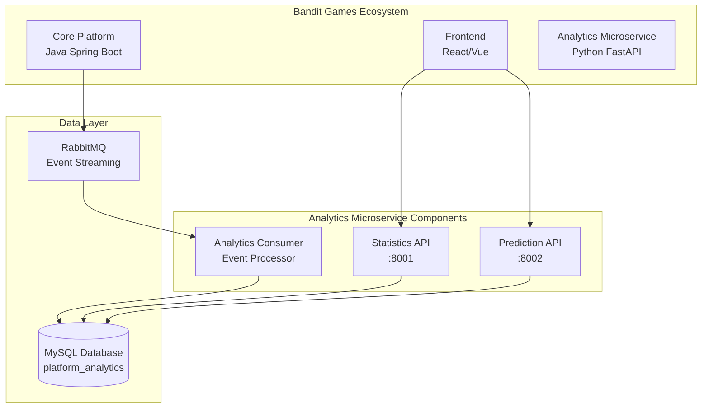

# 🎮 Bandit Games Analytics Microservice

<div align="center">


**Real-time Analytics & Machine Learning for the BanditGaming Platform**

[](https://gitlab.com/kdg-ti/integration-5/2024-2025/team7/analytics)
[](LICENSE)
[](CHANGELOG.md)

</div>

---

## 📋 Table of Contents

- [Overview](#-overview)
- [Architecture](#-architecture)
- [Features](#-features)
- [Tech Stack](#-tech-stack)
- [Quick Start](#-quick-start)
- [API Documentation](#-api-documentation)
- [Machine Learning Models](#-machine-learning-models)
- [Deployment](#-deployment)
- [Development](#-development)
- [Contributing](#-contributing)
- [License](#-license)

---

## 🎯 Overview

The **Bandit Games Analytics Microservice** is a specialized service within the larger Bandit Games ecosystem, designed to provide real-time analytics, statistics, and machine learning predictions for gaming platforms. This microservice processes gaming events, analyzes player behavior, and delivers actionable insights through RESTful APIs.

### 🏗️ System Context

This microservice operates as part of the **Bandit Games Platform** alongside:

- **Core Platform** (Java Spring Boot) - User management, game lobbies, achievements
- **Frontend** (React/Vue) - Player and admin interfaces
- **Analytics Microservice** (Python) - This service

---

## 🏛️ Architecture




### 🔄 Data Flow

1. **Event Ingestion**: Core platform sends game events via RabbitMQ
2. **Real-time Processing**: Analytics Consumer processes events and updates database
3. **Data Storage**: MySQL stores player statistics and game data
4. **API Services**: Statistics and Prediction APIs serve data to frontend
5. **ML Predictions**: Machine learning models provide insights and forecasts

---

## ✨ Features

### 📊 Real-time Analytics
- **Player Statistics**: Comprehensive player performance metrics
- **Game Analytics**: Popular games, top players, engagement trends
- **Live Dashboards**: Real-time data visualization for admins

### 🤖 Machine Learning Predictions
- **Player Churn Prediction**: Identify at-risk players
- **Win Probability**: Predict likelihood of winning next game
- **Engagement Forecasting**: Predict future player engagement levels
- **Skill Classification**: Categorize players (novice, intermediate, expert)

### 🔄 Event Processing
- **Real-time Event Streaming**: Process game events via RabbitMQ
- **Automatic Statistics Updates**: Database triggers maintain current stats
- **Error Handling**: Robust message processing with retry mechanisms

### 🚀 Scalability & Performance
- **Containerized Services**: Docker-based deployment
- **Horizontal Scaling**: Independent scaling of each service
- **Cloud Integration**: Azure App Service deployment
- **CI/CD Pipeline**: Automated build, test, and deployment

---

## 🛠️ Tech Stack

### Backend Services
- **Python 3.9** - Core programming language
- **FastAPI** - Modern, fast web framework for APIs
- **SQLAlchemy** - Database ORM and connection management
- **Pika** - RabbitMQ client for Python

### Machine Learning
- **Scikit-learn** - Machine learning algorithms
- **Pandas** - Data manipulation and analysis
- **NumPy** - Numerical computing
- **Jupyter Notebooks** - Model development and experimentation

### Data & Messaging
- **MySQL 8.0** - Primary database
- **RabbitMQ** - Message broker for event streaming
- **Redis** - Caching layer (optional)

### Infrastructure
- **Docker** - Containerization
- **Docker Compose** - Multi-container orchestration
- **Azure App Service** - Cloud hosting
- **GitLab CI/CD** - Continuous integration and deployment

---

## 🚀 Quick Start

### Prerequisites

- Docker and Docker Compose
- Python 3.9+ (for local development)
- Git

### Option 1: Docker (Recommended)

```bash
# Clone the repository
git clone https://github.com/HopeyCodeDS/bandit-games-ml-analytics.git
cd bandit-games-ml-analytics

# Start all services
docker-compose up -d

# Check service status
docker-compose ps
```

### Option 2: Local Development

```bash
# Clone and navigate
git clone https://github.com/HopeyCodeDS/bandit-games-ml-analytics.git
cd bandit-games-ml-analytics

# Create virtual environment
python -m venv venv
source venv/bin/activate  # On Windows: venv\Scripts\activate

# Install dependencies
pip install -r requirements.txt

# Start services individually
# Terminal 1: Statistics API
cd GameAnalytics && uvicorn player_statistics_API_new:app --host 0.0.0.0 --port 8001

# Terminal 2: Prediction API
cd PredictionSystem && uvicorn unified_prediction_api:app --host 0.0.0.0 --port 8002

# Terminal 3: Analytics Consumer
cd communication && python analytics_consumer.py
```

### 🌐 Service Endpoints

| Service | URL | Description |
|---------|-----|-------------|
| Statistics API | http://localhost:8001 | Player and game statistics |
| Prediction API | http://localhost:8002 | ML predictions and insights |
| API Documentation | http://localhost:8001/docs | Interactive API docs |

---

## 📚 API Documentation

### Statistics API (`:8001`)

#### Get Player Statistics
```http
GET /api/stats/players?skip=0&limit=20
```

#### Get Player by ID
```http
GET /api/stats/player/{player_id}
```

#### Get Game Statistics
```http
GET /api/stats/game/{game_id}
```

#### Get Platform Summary
```http
GET /api/stats/summary
```

### Prediction API (`:8002`)

#### Get All Predictions
```http
POST /api/predictions
Content-Type: application/json

{
  "total_games_played": 50,
  "total_moves": 1250,
  "total_wins": 30,
  "total_losses": 20,
  "total_time_played_minutes": 1200,
  "gender": "Male",
  "country": "USA",
  "game_name": "Chess",
  "age": 25
}
```

#### Individual Predictions
- `POST /predict/churn` - Churn prediction
- `POST /predict/win_probability` - Win probability
- `POST /predict/engagement` - Engagement prediction
- `POST /predict/classification` - Skill classification

---

## 🤖 Machine Learning Models

### Model Performance

| Model | Accuracy | Purpose | Features |
|-------|----------|---------|----------|
| **Churn Prediction** | 95% | Identify at-risk players | Games played, win ratio, demographics |
| **Win Probability** | 88% | Predict next game outcome | Historical performance, player level |
| **Engagement** | 92% | Forecast engagement levels | Activity patterns, demographics |
| **Classification** | 94% | Skill level categorization | Performance metrics, playtime |

### Model Training

Models are trained using Jupyter notebooks in the `Database_Based_PredictionSystem/` directory:

- `playerChurn/` - Churn prediction models
- `winProbability/` - Win probability models
- `gameEngagement/` - Engagement prediction models
- `playerClassification/` - Skill classification models

---

## 🚀 Deployment

### Azure App Service

The service is automatically deployed to Azure using GitLab CI/CD(during the development of this project gitlab was primarily used):

```yaml
# .gitlab-ci.yml stages
stages:
  - build
  - test
  - deploy
```

### Environment Variables

```bash
# Database Configuration
DB_USER=azureuser
DB_PASSWORD=your_password
DB_HOST=your-mysql-server.mysql.database.azure.com
DB_PORT=3306
DB_NAME=platform_analytics

# RabbitMQ Configuration
RABBITMQ_HOST=your-rabbitmq-host
RABBITMQ_PORT=5672
RABBITMQ_USERNAME=your_username
RABBITMQ_PASSWORD=your_password

# CORS Configuration
ALLOWED_ORIGINS=https://your-frontend-domain.com
```

### Docker Images

Pre-built images are available on Docker Hub:

```bash
docker pull opeyemimomodu/statistics-api:latest
docker pull opeyemimomodu/prediction-api:latest
docker pull opeyemimomodu/analytics-consumer:latest
```

---

## 🛠️ Development

### Project Structure

```
analytics/
├── communication/           # Event processing service
│   ├── analytics_consumer.py
│   ├── Dockerfile
│   └── requirements.txt
├── GameAnalytics/          # Statistics API
│   ├── player_statistics_API_new.py
│   ├── Dockerfile
│   └── requirements.txt
├── PredictionSystem/       # ML Prediction API
│   ├── unified_prediction_api.py
│   ├── models/             # Trained ML models
│   ├── notebooks/          # Jupyter notebooks
│   ├── Dockerfile
│   └── requirements.txt
├── Database_Based_PredictionSystem/  # Model development
├── dataCreation/           # Database schemas
├── docker-compose.yml      # Local development
└── .gitlab-ci.yml         # CI/CD pipeline
```

### Adding New Features

1. **New ML Model**: Add to `PredictionSystem/notebooks/`
2. **New API Endpoint**: Add to respective FastAPI service
3. **New Event Type**: Update `communication/analytics_consumer.py`
4. **Database Changes**: Update schemas in `dataCreation/`

---

## 🤝 Contributing

1. Fork the repository
2. Create a feature branch (`git checkout -b feature/amazing-feature`)
3. Commit your changes (`git commit -m 'Add amazing feature'`)
4. Push to the branch (`git push origin feature/amazing-feature`)
5. Open a Pull Request

---

## 📄 License

This project is licensed under the MIT License - see the [LICENSE](LICENSE) file for details.

---


<div align="center">

**Built with ❤️ by the Bandit Games Team**

[](https://gitlab.com/kdg-ti/integration-5/2024-2025/team7/analytics)
[](https://azure.microsoft.com/)

</div>